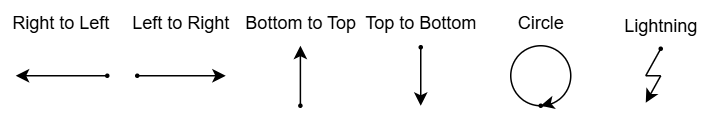
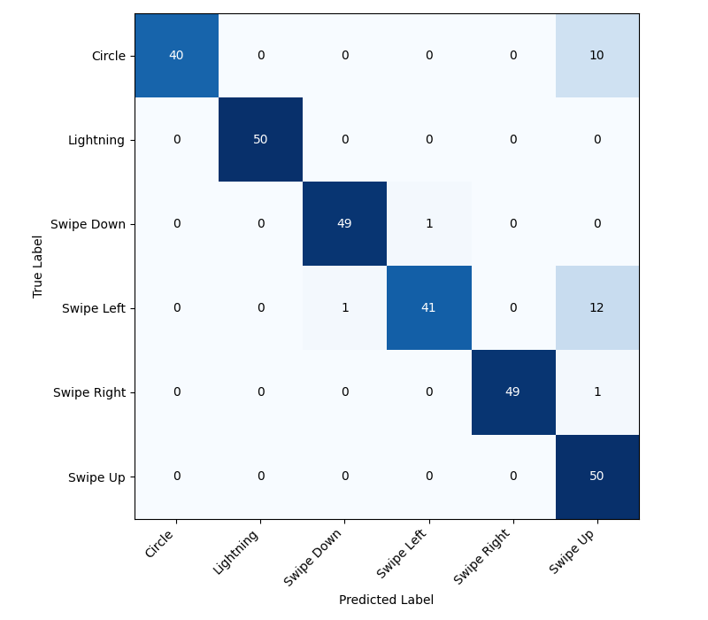
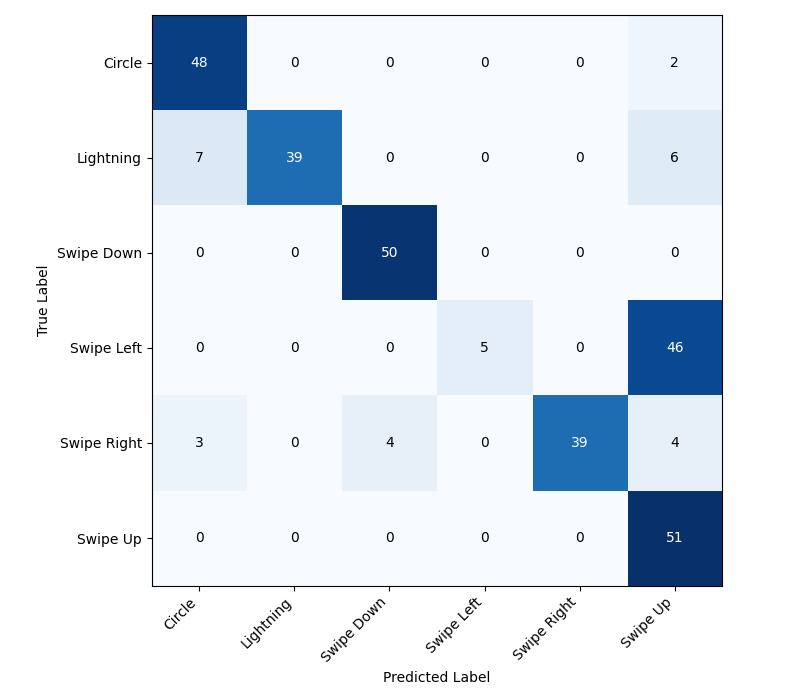

## Background

I built an embedded gesture-recognition “wand” that classifies 6 IMU gestures on an STM32F411RE in real time, then used it as a testbed to compare opaque AutoML (in this case [NanoEdgeAI](https://www.st.com/en/development-tools/nanoedgeaistudio.html)) against a fully transparent Scikit-learn → [emlearn](https://emlearn.readthedocs.io/en/latest/index.html) → C pipeline. AutoML tools can be fast, but when model internals aren’t visible, debugging and long-term maintenance can be painful. The core question here was: *can an ML newbie use an open pipeline to create models that match (or beat) NanoEdgeAI on real hardware accuracy, latency, and memory while staying reproducible and inspectable?*

## Hardware + Dataset

- **MCU:** NUCLEO-F411RE (Cortex-M4F, 512 KB flash / 128 KB SRAM)
- **IMU:** MPU9250 (accel + gyro used; mag ignored) over I2C
- **Sampling:** 200 Hz, accel ±16 g, gyro ±2000 dps, 16-bit
- **Gestures:** circle, lightning, swipe up/down/left/right
- After cleaning + standardizing duration, the final dataset used for training was 1200 labeled samples (200 per gesture). Each sample was resampled to 100 time steps and flattened into a 600-element feature vector (6 channels × 100).

.")

## Two model pipelines

### 1) NanoEdgeAI (opaque / generated)

- Generated and ranked many candidates; I exported the top **SVM**, **RF**, and **MLP** by NanoEdgeAI’s “quality index” and deployed the generated C to the MCU.

### 2) Transparent pipeline (reproducible)

- Trained Scikit-learn MLP + RF variants, selected configs using a weighted score prioritizing balanced accuracy (with small penalties for estimated compute + memory), then converted to C using emlearn for on-device inference.

Final evaluation was on-device using a new participant (not in the training set), 50 trials per gesture, recording predicted class + inference time.

## Key results (on-device)

| Model                           | On-device accuracy | On-device inference time | Compiled flash |
| ------------------------------- | -----------------: | -----------------------: | -------------: |
| **Custom MLP (Scikit→emlearn)** |         **91.78%** |                  3178 µs |     115.836 KB |
| **NanoEdgeAI MLP**              |             91.00% |                   824 µs |      35.880 KB |
| **NanoEdgeAI SVM**              |             81.67% |                   454 µs |      29.004 KB |
| **Custom RF (Scikit→emlearn)**  |             76.32% |             **15.27 µs** |      30.292 KB |
| **NanoEdgeAI RF**               |             51.00% |                   412 µs |      37.484 KB |







Two practical observations mattered more than the headline numbers:

- **“Blind spots” happened.** NanoEdgeAI’s SVM and RF failed completely on the circle gesture during live testing (0% correct), and NanoEdgeAI RF also showed a blind spot for lightning.
- **Estimated performance ≠ deployed performance.** Across models, real on-device behavior diverged from tool-reported estimates—especially for NanoEdgeAI.

## What I’d do differently next

- **Quantize / fixed-point** custom models to shrink flash (the custom MLP used float weights, inflating size).
- A lot more time could be put into the implementation of the custom models. Due to the short-timeline it was deemed out of scope.
- Collect a **bigger, more variable** dataset (inter-user motion inconsistency was a real limiter).
- Explore [Burn](https://burn.dev/) :crab:

## Full write-up

If you want the full methodology, plots, and confusion matrices, the complete paper is here:
<a href="/docs/TinyML-paper.pdf" target="_blank" rel="noopener noreferrer">Cracking the Code: Achieving High-Performance Embedded Gesture Recognition with Transparent Pipelines</a>
