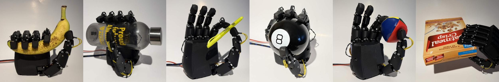
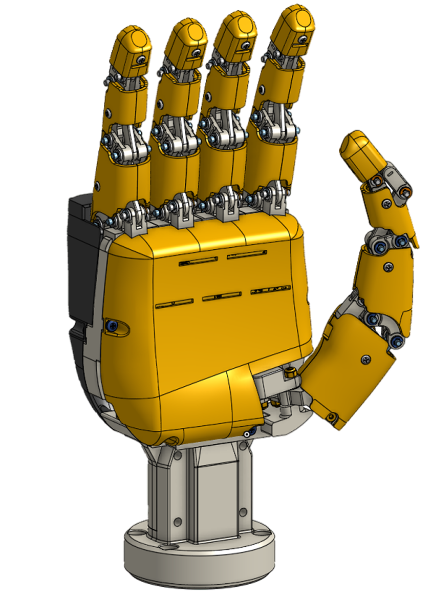
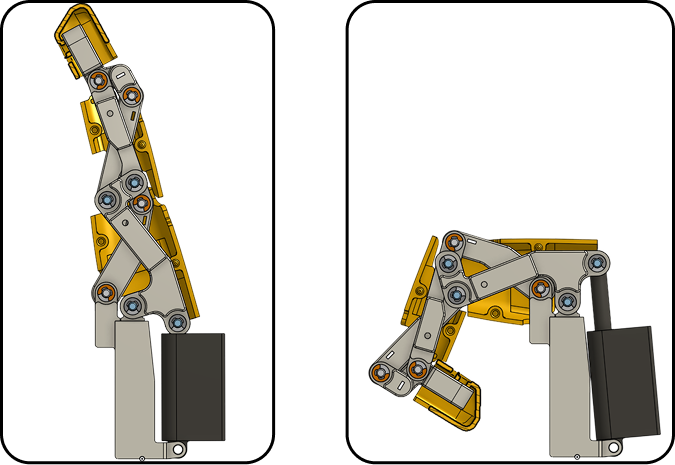
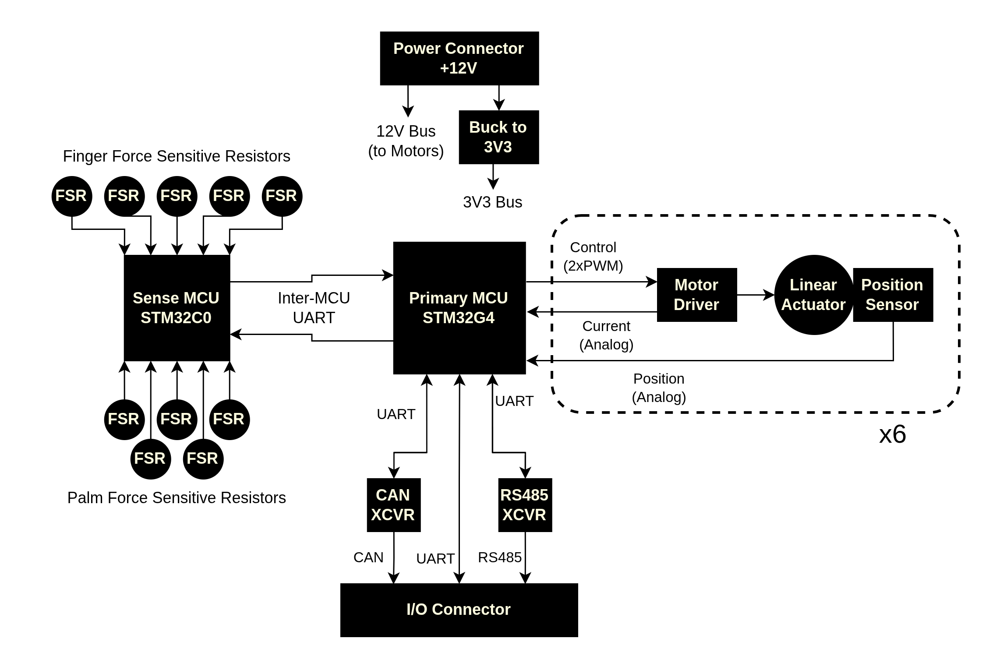

## Background

For our final-year engineering project, my team and I built **BananaHand**, a fully open-source humanoid robotic hand designed for dexterous manipulation research. The goal was to create something more capable than a simple parallel gripper, but far more accessible than commercial anthropomorphic hands that can cost tens of thousands of dollars and are difficult to modify.

The final system is a five-finger humanoid hand with 16 degrees of freedom, 6 degrees of actuation, integrated tactile sensing, a custom palm-mounted control board, Rust firmware, and a ROS 2 software stack for teleoperation and grasp selection. More importantly, the full project was built around reproducibility: the CAD, PCB files, firmware, software, BOM, and assembly resources are open-source so that future teams can build on the platform instead of starting from scratch.



## Project Summary

Robotic manipulation research has a hardware problem. When we looked into the space, we found that existing options tend to fall into two extremes. On one end, there are relatively cheap humanoid hands, but they often lack the dexterity, sensing, robustness, or documentation needed for meaningful research. On the other end, there are highly capable open-source and commercial hands, but many are too expensive or difficult to reproduce for smaller labs, startups, and student teams.

BananaHand was our attempt to sit in the middle of that tradeoff.

We wanted a hand that was:

* human-proportional enough to interact naturally with everyday objects
* dexterous enough to perform common grasp families
* robust enough for repeated testing
* electrically and mechanically compact enough to mount on a lightweight robot arm
* inexpensive enough that other teams could realistically build one
* open-source across the mechanical, electrical, firmware, and software stack

The final prototype demonstrated five target grasp types: pinch, tripod, hook, cylindrical, and spherical. It used Actuonix PQ12 linear actuators to drive the fingers through linkage mechanisms, measured contact through force-sensitive resistors in the fingertips and palm, and communicated with a host computer through a ROS 2 interface.

At the system level, BananaHand was able to hold representative everyday objects, sustain a textured cylindrical payload of about 5 lb, complete 100 full-power open-close cycles without visible or functional damage, and return live position, force, and current telemetry during operation.

## Design Overview

BananaHand is split into four major layers: mechanical design, electrical hardware, embedded firmware, and high-level software. I’ll keep this section high-level, since the diagrams and photos show the architecture more clearly than a long written breakdown.

<!-- markdownlint-disable MD034 -->

<!-- markdownlint-enable MD034 -->



Mechanically, BananaHand uses a five-finger anthropomorphic layout. Each of the four fingers is driven by a compact linear actuator through a coupled linkage mechanism. The MCP joint is actively driven, while the PIP and DIP joints follow through the linkage geometry. This allowed the hand to get human-like finger curling from a relatively small number of actuators.







The thumb uses a modified version of the same linkage idea, with a second actuator dedicated to opposition. That thumb opposition axis is what lets the hand move beyond simple wrap grasps and perform more useful interactions like pinch and tripod grasps.

Most of the custom mechanical components are FDM 3D printed, with off-the-shelf fasteners, pins, bushings, washers, and actuators used where possible. Protective shells cover the palm, back of hand, and fingers, protecting the internal mechanisms while also creating more realistic contact surfaces for grasping.





The electrical system is built around a custom main board mounted directly in the palm of the hand. The board consolidates power distribution, motor driving, actuator position sensing, motor-current sensing, force-sensor acquisition, and external communication.

The board takes a single 12 V input. The PQ12 actuators run from the 12 V rail, while an onboard buck converter generates 3.3 V for the microcontrollers and logic-level electronics. Resettable fuses provide basic protection during development and testing.

The final architecture uses two microcontrollers. An STM32G474 acts as the primary controller, handling host communication, motor control, position feedback, current feedback, and telemetry. An STM32C071 acts as a dedicated force-sensing front end, reading the fingertip and palm FSRs and streaming force data to the G4.

The motor drive stage uses DRV8876 H-bridge drivers. Six channels are used for the current hand build, with eight motor-driver circuits present on the board. Each actuator gets PWM drive signals, analog position feedback from the PQ12’s built-in potentiometer, and current-sense feedback from the motor driver. The board also exposes UART, CAN, and half-duplex RS485 so the hand is not locked into a single integration path.





On the high-level software side, the project includes two main user-facing paths.

The first is vision-based teleoperation. A webcam tracks a human operator’s hand, extracts hand landmarks, normalizes finger motion, and maps that motion into actuator commands for BananaHand. This gave us a lightweight control method that did not require a glove, markers, or a motion-capture system.

The second is a scan-based grasp-selection pipeline. Using RGB-D data from a RealSense camera, the software reconstructs a partial point cloud of an object, removes the table plane, extracts geometric descriptors, and classifies the object into one of the supported grasp families. Instead of using a trained model, we used a rule-based geometric classifier so the decisions were interpretable and easier to debug within the project timeline.





The firmware is the bridge between the ROS-side software and the physical hardware. Commands arrive from the host, sensor readings are collected from the board, control loops compute motor outputs, and telemetry is sent back for visualization and debugging.

The final firmware is written in Rust using Embassy. There are two firmware targets: one for the STM32G474 primary controller and one for the STM32C071 sensing controller. The C0 samples 10 force-sensitive resistor channels and streams packed 12-bit readings to the G4. The G4 runs concurrent tasks for command reception, telemetry transmission, force-packet reception, position ADC sampling, current ADC sampling, and actuator control.

The main control loop runs at 200 Hz. It supports both position control and force control. In position mode, commands are interpreted as actuator position targets. In force mode, commands are interpreted as force targets for channels with force feedback. In both cases, the firmware converts the controller output into motor-driver PWM commands.



## A Deeper Look At My Contributions

My main ownership areas were the electrical subsystem and embedded firmware. I was the only team member working directly on the electrical design, so I was responsible for turning the hand’s system requirements into a real PCB architecture that could fit inside the mechanical envelope and support the firmware, controls, and software goals.

That meant the electrical design could not be done in isolation. The PCB had to match the actuator choices from the mechanical team, fit into the palm packaging, expose the right signals for firmware, provide enough observability for tuning and debugging, and remain simple enough to one-shot design and bring up within 2-months.

I also wrote a significant portion of the firmware, especially the low-level embedded infrastructure needed to drive the actuators from Rust. For me, the most technically interesting part of that work was building a custom HAL layer for the STM32G474 HRTIM peripheral so it could be used cleanly from the Embassy-based firmware stack.

### Electrical

The electrical design started from a simple requirement: the hand needed one compact board that could make the whole system usable. It had to drive the actuators, read position feedback, read tactile sensors, provide useful telemetry, communicate with a host computer, and physically fit inside the palm.

During early development, breakout boards were used to validate individual circuits, evaluate component choices, and provide a flexible platform for firmware development in parallel with hardware design. These setups were never intended to represent the final architecture, but they were essential for de-risking key parts of the system before committing to a custom PCB.

#### Architecture: from distributed concept to two-MCU board

The final architecture uses a two-MCU design that balances modularity with integration simplicity.

The STM32G474 serves as the primary controller. It provides the peripheral set and compute headroom needed for motor control, ADC sampling, UART communication, and telemetry. It also includes a high-resolution timer peripheral, which is important for generating the number of PWM channels required by the motor drivers.

The STM32C071 acts as a dedicated force-sensing controller, behaving almost like a smart ADC: it samples the force sensors, packs the readings, and streams them to the G4. This split works well because the FSR system is repetitive, independent, and easy to isolate, keeping the force acquisition path modular while allowing the main controller to focus on control and communication tasks. Early in development we were also unsure how well the FSR sensing would perform, so having a separate controller gave us a place to add filtering or signal processing if needed to improve data quality. Treating the C0 as a smart ADC also gave us flexibility to rework the sensing layer or swap in different sensor types if needed, and it opens the door for more advanced sensor fusion or filtering in future iterations.

This architecture reduces firmware complexity, simplifies board bring-up, and preserves clear subsystem separation. The G4 handles timing-sensitive control and communication, while the C0 handles force sensing.

#### Actuator feedback: using the sensors we already had

The original concept considered external magnetic encoders for actuator position feedback. That would have provided a clean position measurement path, but it also would have added cost, routing complexity, and, most importantly, significant mechanical integration burden in terms of packaging constraints and precise alignment requirements, along with more things to debug.

The final design instead used the built-in potentiometer feedback from the Actuonix PQ12P actuators. Those position signals are routed directly to ADC inputs on the STM32G474.

This was a pragmatic decision. The project did not need high-resolution joint encoders to prove out the hand. What we needed was stable, good-enough actuator feedback for repeatable motion and closed-loop position control. Using the PQ12P feedback kept the electrical and mechanical systems much simpler while still meeting the needs of the prototype.

It also helped reduce the final unit cost. The final hand ended up below the original cost target by a large margin, and avoiding unnecessary sensing hardware was one of the reasons that was possible.

#### Motor driving and current visibility

Each actuator is driven through a DRV8876 H-bridge motor driver. This part was chosen because it provided a good balance of simplicity, control flexibility, and useful feedback for a robotics application. The PWM-based interface was straightforward to integrate with the STM32G474, allowing each motor channel to be controlled using two PWM inputs without requiring a more complex motor-control IC or communication protocol.

One of the key advantages of the DRV8876 is its support for multiple drive states, including forward, reverse, braking, and coasting. The ability to coast is particularly important in robotics, where allowing joints to move freely under load can reduce mechanical stress and enable smoother interactions during grasping and release. This flexibility also made it easier to implement safe behaviour during mode changes and integration testing.

The DRV8876 also exposes current-sense feedback, routed to ADC inputs on the STM32G474. For the MVP, this was primarily used for telemetry and observability, but it provides a clear path toward more advanced features in future revisions, such as stall detection, overcurrent protection, current-based load estimation, and more responsive grip control.

One design choice I’m glad I made was including eight motor-driver circuits even though the final build only used six actuator channels. The original mechanical plan targeted eight degrees of actuation, but due to the complexity of the project and the limited timeline, we scaled back to a six-actuator MVP. Having those extra channels gave us flexibility while the mechanical design was still evolving. In a project like this, where the mechanical and embedded designs are developed in parallel, a small amount of electrical margin can prevent a board from becoming obsolete as requirements change.

#### Force sensing: simple analog front end, useful result

The force-sensing system uses force-sensitive resistors in the fingertips and palm. Electrically, each FSR is read through a simple voltage divider. I used a 10 kΩ fixed resistor value because the goal was early contact detection rather than precise force measurement over a large calibrated range.

That distinction mattered. FSRs are not precision load cells, and pretending otherwise would have made the design worse. For this hand, the first useful question was not “what exact force is being applied?” but “has the finger or palm made contact yet, and is the contact increasing?” A simple divider circuit was enough for that.

There was also a strong practicality argument behind this choice. FSRs are by far one of the cheapest and simplest tactile sensing options available, which aligned well with the project’s goal of being accessible and reproducible. More advanced approaches, like Hall-effect-based sensing, would have been very interesting from a performance standpoint, but they introduce significant additional complexity across electrical design, mechanical integration, and firmware. Implementing that kind of system properly could easily become a full capstone project on its own.

The outcome matched the goal. In testing, the system detected fingertip activation around 16 g and palm activation around 10 g. Those values were sensitive enough for early contact detection and met the tactile-sensing needs of the MVP. The palm being slightly more sensitive also made practical sense during grasping, since larger objects often contact the palm before the fingertips fully close.

#### Power architecture

The power system was intentionally simple. The board takes a single 12 V input. The actuators use that 12 V rail directly, and an onboard MPM3610 buck converter generates 3.3 V for the logic circuitry.

This avoided needing multiple external supplies and made the hand easier to integrate into a robot-arm or bench-test setup. The final calculated draw was about 21 W, or roughly 1.75 A from the 12 V source, so the board was designed around that power level with resettable fuse protection on both the 12 V input and 3.3 V logic rail.

The main tradeoff was packaging and routing. The PCB needed to carry motor current, low-level analog sensor signals, digital communication, and two MCUs in a compact palm-shaped outline. To make that manageable, I used a four-layer PCB stackup with dedicated ground and power structure. That made routing easier, gave cleaner return paths, and reduced the amount of compromise needed around the mixed-signal portions of the board.

#### Communication interfaces

UART was the main interface used during development and testing because it was easy to bring up, easy to debug, and supported by the ROS serial bridge. However, I also included CAN and half-duplex RS485 hardware on the board.

Those extra interfaces were not necessary for the first demo, but they were cheap insurance for future integration. UART is convenient on the bench, but CAN and RS485 are more realistic for many robot and industrial-style systems. Since the hand was intended to be an extensible open-source platform, exposing those interfaces made the board more useful beyond our exact MVP demo.

#### Bring-up and what actually happened

A large part of the electrical work was not just schematic capture and layout. It was making the board possible to bring up without chaos.

Before committing to the integrated PCB, I validated the core functions with development hardware: STM32 Nucleo boards, DRV8876 breakout boards, Actuonix interface boards, and simple FSR circuits. That gave confidence in the major circuit choices before combining everything onto one board.

Once the assembled PCBA arrived, I brought it up through a structured sequence of checks spanning basic electrical validation, power integrity, programming and debug access, peripheral functionality, sensor verification, inter-MCU communication, and finally full system integration with motors and telemetry.

This staged process paid off. The board did not require rework-critical fixes, and the electrical system met the MVP needs: it powered the hand, drove the actuators, read position feedback, read force sensors, reported telemetry, and fit inside the mechanical design.

There were still small revision-level issues. Some connector labelling and channel-mapping details were not as clean as they should have been, and one of the motor-channel conventions had to be handled carefully in firmware. But those issues did not block performance. They were the kind of first-revision hardware flaws that are annoying, documented, and very fixable in the next spin.

The most important outcome was that the board worked as an integrated embedded system. It was not just a PCB that powered on; it became the hardware foundation that let the rest of the project function.

### Firmware

The firmware had to turn the board into a controllable robotic hand. That meant coordinating multiple data streams at once: host commands, actuator positions, motor currents, force readings from the second MCU, control-loop outputs, and telemetry back to the PC.

I wrote a large portion of this firmware that used a in Rust using Embassy. The final design uses two firmware targets: one for the STM32G474 primary controller and one for the STM32C071 force-sensing controller.

#### Why Rust and Embassy

Rust was a good fit for this project because the firmware had a lot of stateful embedded logic: packet handling, shared sensor snapshots, motor-control state, and multiple concurrent tasks. The type system helped make the code more explicit, especially around hardware interfaces and shared data structures.

Embassy gave us an async embedded framework that fit the structure of the problem. The firmware did not need one giant blocking loop that manually checked every peripheral. It needed several independent tasks: receive commands, send telemetry, read force data, sample ADCs, and run control. Embassy made that architecture much cleaner.

The tradeoff was that some lower-level STM32G4 peripheral support was not available in the form we needed. That became most obvious with the HRTIM peripheral, which is why I ended up writing a custom HAL layer.

#### Firmware partitioning between the G4 and C0

The STM32C071 firmware is intentionally simple. It samples 10 FSR channels at 200 Hz, packs the 12-bit ADC readings into a compact packet, adds a checksum, and sends the result to the STM32G474 over UART.

Keeping the C0 firmware narrow was a deliberate design choice. The C0 does not need to understand hand-level behaviour, control modes, or host commands. Its job is to provide a clean force-sensor stream. That makes it easier to test and easier to replace or revise later.

The STM32G474 firmware handles the rest of the system. It receives commands from the host, receives force packets from the C0, samples actuator positions, samples motor currents, runs the control loop, updates the motor PWM outputs, and sends telemetry back to the PC.

That split worked well because it matched the electrical architecture. The G4 had the peripherals and performance needed for real-time control, while the C0 removed a chunk of repetitive analog acquisition from the main controller.

#### Task structure on the G4

The G4 firmware is organized around concurrent Embassy tasks and a main control loop.

Separate tasks handle:

* host command reception over USART3
* telemetry transmission over USART3
* force packet reception from the C0 over USART2
* actuator position sampling on ADC1
* motor-current sampling on ADC2

These tasks write their latest values into shared state. The control loop then reads snapshots of that state and computes motor outputs.

This structure was important because different parts of the system operate at different rates and have different timing needs. Telemetry should not block command reception. ADC sampling should not block UART parsing. Force-packet reception should not interfere with motor control. Splitting these into tasks kept the code more modular and made integration failures easier to isolate.

#### Control loop design

The main control loop runs at 200 Hz. It supports two operating modes: position control and force control.

In position mode, the host sends actuator position targets. The firmware reads the PQ12 position feedback through ADC channels, converts raw ADC values into approximate actuator stroke position, and runs a PID loop for each controlled actuator.

In force mode, the host sends force targets. The firmware reads force data from the C0 and runs a PID loop using the corresponding FSR channel where force feedback is available. Not every actuator has a meaningful force channel, so the firmware explicitly handles those cases instead of pretending every motor can be force-controlled in the same way.

One design choice I like is that commands are treated as targets, not direct motor outputs. The host does not tell the motor drivers what duty cycle to use. It tells the hand what state it wants, and the firmware decides how to drive the actuators based on feedback. That makes the firmware the correct boundary between high-level intent and hardware behaviour.

The motor-command layer maps controller output into four meaningful driver states: move in, move out, brake, and coast. That abstraction made the control code easier to reason about and also gave us safer behaviour during mode changes. For example, when switching control modes, the firmware waits for a fresh command before applying outputs, rather than blindly reusing stale command data from the previous mode.

#### Custom HRTIM HAL

The most technically interesting firmware work I did was writing a custom HAL for the STM32G474 HRTIM peripheral.

The hand needed many PWM outputs for the motor drivers. The STM32G474 has a high-resolution timer peripheral that is well suited to this kind of motor-control workload, but the Embassy HAL did not expose the HRTIM functionality we needed in a clean way at the time. The hardware capability was there, but the software abstraction was missing.

So I wrote a small `no_std` HAL crate that exposed HRTIM subtimers as PWM-capable handles that could be used from the rest of the Embassy firmware.

At a high level, the HAL handles:

* enabling the HRTIM peripheral
* configuring subtimers A through F
* calculating period register values from the system clock, APB prescaler, HRTIM prescaler, and desired PWM frequency
* setting up GPIO pins in the correct alternate-function mode
* enabling individual HRTIM outputs
* setting PWM duty cycle by percentage
* returning typed PWM handles for each configured subtimer/channel pair

The design uses Rust’s type system to represent which subtimers and channels have been configured. Instead of passing around loosely defined channel numbers, the firmware gets concrete PWM handles for the configured outputs. That made the board mapping code cleaner and reduced the chance of mixing up channels accidentally.

In the final firmware, the HRTIM outputs are mapped directly to the actuator motor-driver inputs for most of the hand. TIM1 is also used for the thumb opposition channel, while the HRTIM subtimers drive the other actuator channels.

This was a good example of embedded work sitting right between software and hardware. The PCB exposed the right timer-capable pins. The STM32G474 had the right peripheral. The firmware architecture needed clean PWM objects. The missing piece was a small abstraction layer that connected all three.

#### Board mapping as a firmware boundary

One firmware detail that became more useful than expected was the board-map layer. The physical PCB pinout, actuator ordering, ADC channel ordering, and motor-driver channel conventions are not the same thing as the logical hand model.

The firmware separates those concerns. The control code thinks in terms of ring, pinky, thumb flexion, index, middle, and thumb opposition. The board-map code handles which physical pins, ADC channels, and PWM outputs correspond to those logical channels.

That mattered because real hardware is never perfectly clean on revision one. When a channel convention or connector label is not ideal, the rest of the firmware should not need to care. The board-map layer acts as the translation boundary between the physical PCB and the logical hand.

#### Communication and packet design

The firmware uses UART for both host communication and inter-MCU force-sensor communication.

For host communication, the current system uses COBS framing with checksummed payloads. That gave the ROS serial bridge a simple way to send position and force commands to the hand and receive position, force, and current telemetry back.

For force sensing, the C0 sends compact fixed-size packets to the G4. Each packet contains 10 force readings, each represented as a 12-bit ADC value. The shared `common` firmware crate defines the packet layout, sensor ordering, packing logic, parsing logic, and checksum behaviour. This avoided duplicating packet definitions between the C0 producer and G4 consumer.

This shared packet code was important because firmware bugs at communication boundaries are easy to create and annoying to debug. If the sender and receiver disagree about byte order, sensor ordering, packet length, or checksum logic, the system can fail in ways that look like sensor noise or hardware faults. Putting the protocol definition in a shared crate reduced that risk.

#### Telemetry and observability

Telemetry was one of the most important parts of the firmware, especially during integration. The hand returns position, force, and current data to the host, where it can be visualized and logged.

This made debugging much easier. Instead of guessing whether the hand was responding correctly, we could see what the firmware thought was happening. We could compare commanded positions to measured positions, check whether FSR values changed on contact, and monitor motor-current behaviour during motion.

That observability was essential for integration with the ROS stack. The high-level software could publish commands, the firmware could execute them, and the returned telemetry let us verify the full loop rather than only watching the physical hand move.

The final measured round-trip latency through the ROS-to-firmware-to-ROS path was about 89 ms. For our teleoperation demo, that was responsive enough to feel usable and stable.

#### What worked and what I would improve

The firmware architecture worked well for the MVP. The two-MCU split was manageable, Embassy tasks mapped naturally to the system structure, the 200 Hz control loop was sufficient for the actuators, and the telemetry path gave us the visibility needed to debug the integrated hand.

The custom HRTIM HAL also turned out to be one of the highest-leverage pieces of firmware. It let us use the STM32G474 hardware the way the board required, while keeping the rest of the firmware relatively clean.

There are still things I would improve in a next revision.

The communication protocol should be hardened. The current packet structure was good enough for development and demonstration, but a more mature release should include stronger CRCs, sequence IDs, ACK/NACK behaviour, command timeouts, and explicit fault states.

The current-sensing path should also be used more actively. Right now, it is mostly telemetry and future potential. A better controller could use current feedback for overcurrent protection, stall detection, and more intelligent grasp behaviour.

Finally, I would add a more formal calibration procedure. The firmware currently uses simple conversions from ADC counts to position or force estimates. For a research platform, per-actuator and per-sensor calibration would make the returned telemetry more meaningful and would improve repeatability across different builds of the hand.

Even with those future improvements, the firmware reached the most important milestone: it turned a custom PCB, six actuators, ten force sensors, and a ROS command stream into a functioning robotic hand.

## Closing Thoughts

BananaHand was easily one of the most rewarding projects I’ve worked on. It combined mechanical design, embedded electronics, firmware, controls, perception, and system integration into one physical thing that people could actually interact with.

From my side, the most valuable part was owning the electrical system end-to-end and then writing enough firmware to bring that hardware to life. Designing a PCB is one thing; making it drive motors, stream sensor data, survive integration, and respond to a real control stack is the part where the design actually becomes real.

It was also my first serious contribution to an open-source robotics platform. That changed how I thought about the project. The goal was not just to get a demo working for ourselves, but to leave behind something that another team could inspect, build, modify, and improve.

Showing the hand at symposium was a lot of fun. People immediately understood what it was trying to do, and the open-source angle made the project feel larger than a one-off capstone demo. The best outcome would be for BananaHand to become a launch point for future student teams, researchers, and hobbyists working on dexterous manipulation.

Huge thanks to my teammates, mentors, sponsors, and everyone who helped us turn this from a rough idea into a working hand.
