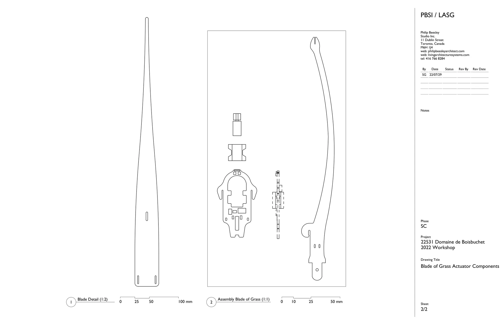
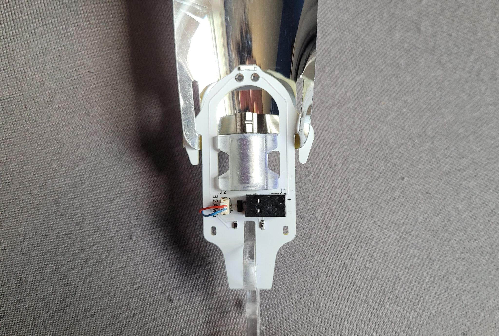
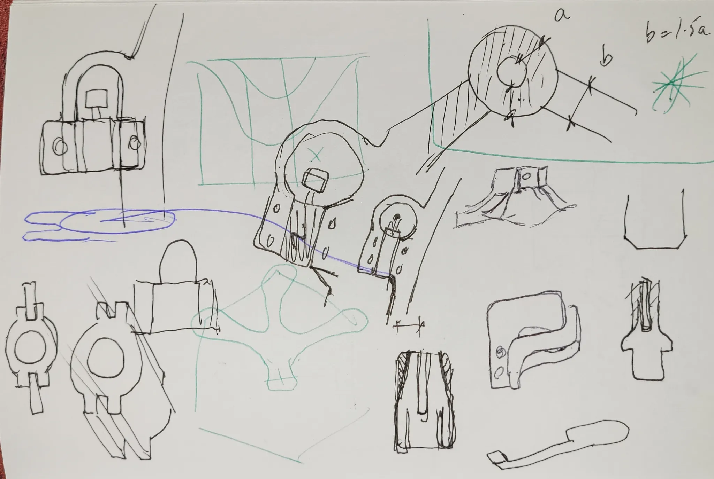
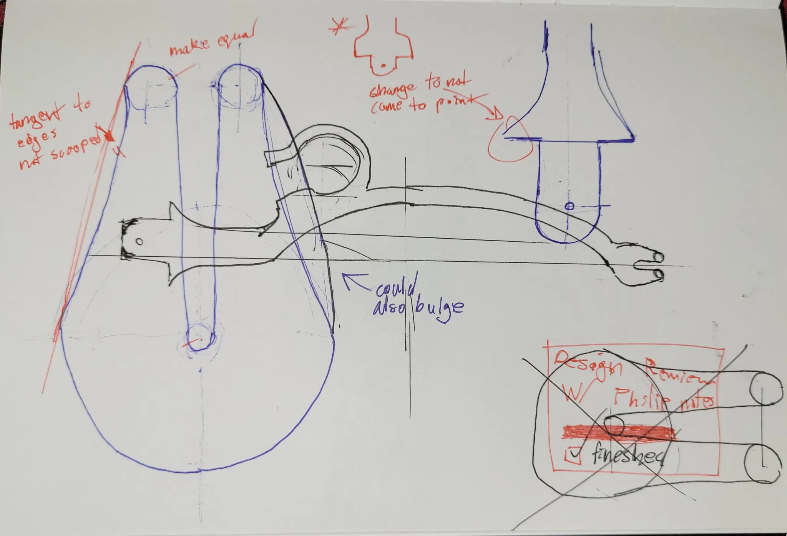
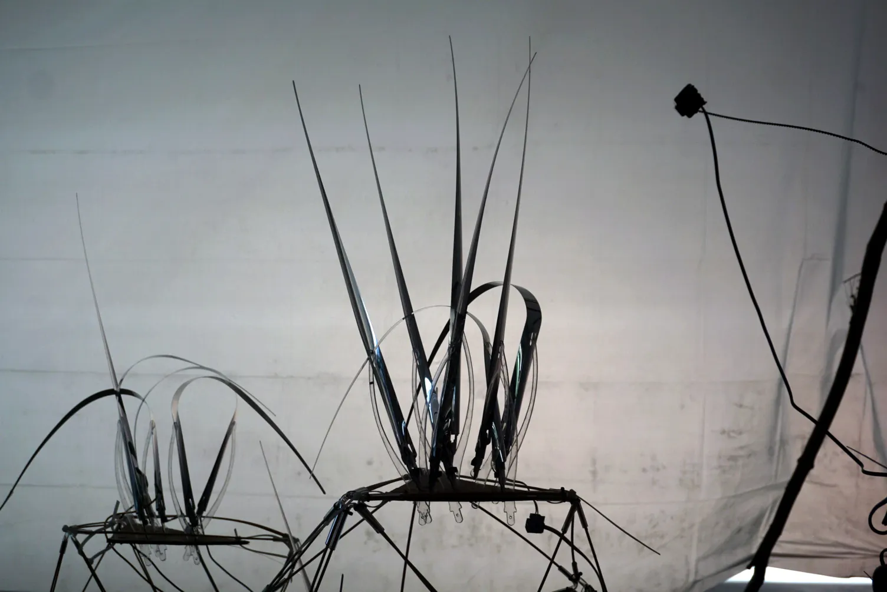
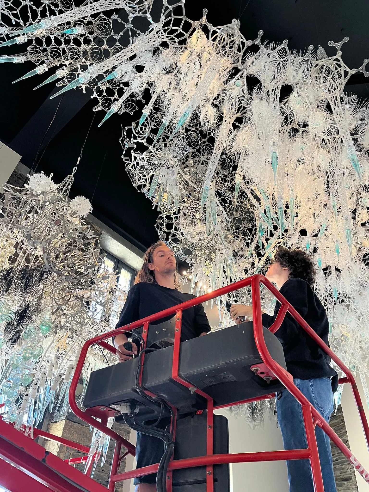

## Background

For my first coop placement in my engineering program (May ‘22 - August ‘22), I had the pleasure of working with [Philip Beesley (PBSI)](https://www.philipbeesleystudioinc.com/) at the [Living Architecture Systems Group (LASG)](https://livingarchitecturesystems.com/). It’s a small team of ~15, consisting of engineers, architects, and artists that design and build responsive environments and interactive sculptures. The studio is based out of Toronto Canada but has large scale tech art installations around the world.

The research group aims can be summarized with the following question:
> How can we design kinetic, living architecture that engages with visitors during extended interactions and enhances human experience in an immersive environment?

## My Work

This was my first internship outside of high-school and I was very eager to combine my love for art and engineering together, so the role of a technical industrial designer was perfect. The studio uses a handful of actuators that emit light, movement or sound to evoke the feeling of a living being. I was tasked with creating a new sculptural vibration actuator that was cheap and could be placed in the hundreds within sculptors to achieve field like behaviour. The inspiration for the projects was blades of grass blowing in the wind:

## Sculpture Actuator - Blade of Grass



The studio has successfully used vibration actuators in past to bring life to the sculptures using a device dubbed the *Moth*. The *Moth* is an incredibly beautiful actuator but it does have its shortcomings, it has a large part count of 20+ individual pieces for hand assembly, assembly itself is quite difficult, and they cost too much to place thousands of them in the sculpture making field behaviour difficult to achieve.

That’s where my project the *Blade of Grass* comes in. It’s a brand new vibration actuator designed to fill the gaps the *Moth* has.



  



### Hardware and Design

The design criteria for the Blade of Grass were as follows:

- Cheap (below 10$/actuator)
- Low part count
- Easy assembly
- Meet aesthetic approval from lead artists and architects

The blade of grass is made up of only 5 components; the 3 mm acrylic bow, the mylar blade, the PCB, the vibration motor, and the resin-printed motor sleeve. The low part count and simplicity of the design lead to a low cost of approximately 8$/actuator @ 100 units and total assmebly time of under 2-minutes.

  
  
  
  
  
  
  
  



The design of the actuator was a very iterative process. Going back and forth with designers refining every last details from the shape of the blade to the radius of fillets on the outline of the PCB. With every prototype I ran stress tests, characterized motion, and created a presentation portfolio to give to the lead architects.

## Conclusion

While it wasn’t my most technical internship, it was one of the most eye-opening. Collaborating with industrial designers and architects—people who deliberate over every visual and spatial detail—was a completely different rhythm from working with engineers. I found myself sketching, iterating, and participating in design critiques far more than usual, and it deepened my appreciation for the precision and artistry behind this type of work. Not to mention the opportunity to fly across world to install tech art is pretty damn cool.

