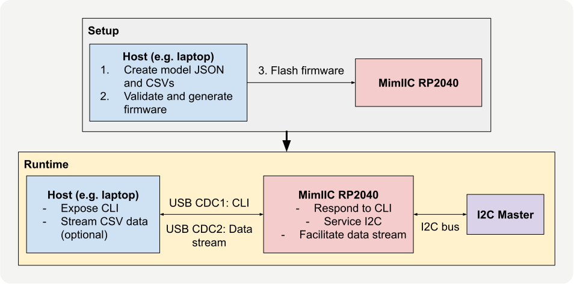
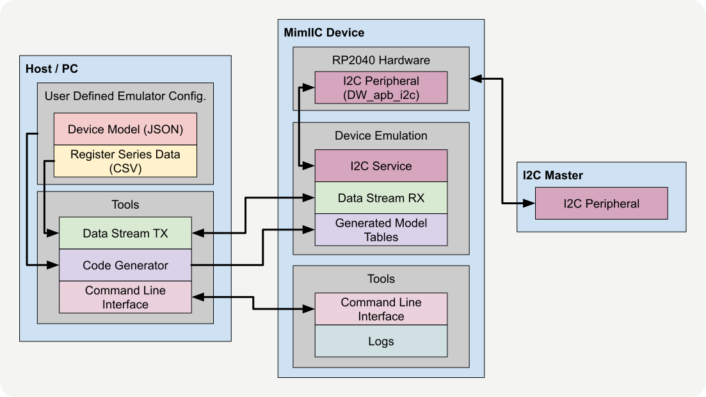

MimIIC is a configurable I²C peripheral emulator built around the RP2040. Describe a register-mapped I²C device in a JSON file, optionally attach CSV data to registers that should change over time, generate firmware tables from that model, and then run the emulator as a real hardware target on an I²C bus.

The motivation came from a problem I have run into several times in embedded development: firmware often needs to be written and tested before the real peripheral hardware is available, stable, or easy to automate. Software mocks are useful, but they skip over the actual electrical and protocol-level behaviour of the bus. MimIIC keeps the real I²C integration path in the loop while making the peripheral side configurable and repeatable.

In practice, this means a firmware developer can test against an emulated sensor, converter, memory device, or simple register-mapped peripheral without rewriting the emulator firmware for every new device.

## What it does

MimIIC emulates a single 7-bit I²C slave device with an 8-bit register address space. Each register can have a default value, an access rule, and optionally a CSV-backed data source. The device supports the common pointer-based register access pattern used by many I²C peripherals, including optional auto-increment for sequential multi-byte reads.

At a high level, the workflow is:

1. Write a JSON device model.
2. Add CSV files for any dynamic registers.
3. Run the generator to validate the model and produce Rust firmware tables.
4. Flash the firmware to an RP2040.
5. Connect an external I²C master and interact with MimIIC like a normal peripheral.
6. Use the CLI and logs to inspect what happened on the device.

A minimal model looks like this:

```json
{
  "device_name": "MimIIC",
  "i2c_address_7bit": 66,
  "default_fill": 255,
  "auto_increment": true,
  "i2c_internal_pullups": true,
  "i2c_respond_to_general_call": true,
  "registers": [
    {
      "addr": 0,
      "default": 18,
      "access": "ro",
      "name": "REG1"
    },
    {
      "addr": 16,
      "default": 0,
      "access": "rw",
      "name": "CONFIG"
    },
    {
      "addr": 32,
      "default": 160,
      "access": "ro",
      "name": "SENSOR_DATA",
      "csv": {
        "path": "csv/data.csv",
        "mode": "host_stream"
      }
    }
  ]
}
```

That model defines the emulated device address, default register fill value, auto-increment behaviour, general-call support, and the register map. The generated firmware then uses static Rust data structures derived from this file instead of parsing configuration on the microcontroller at runtime.



## System architecture

MimIIC is split into three main pieces: host tooling, RP2040 firmware, and the external I²C master under test.

The host-side model generator parses the JSON file, validates the register definitions, loads referenced CSV files, checks memory and stream limits, and emits a generated `model.rs` file. That generated file contains the register specifications, CSV-backed register metadata, lookup tables, and static data arrays used by the firmware.

The RP2040 firmware then runs the actual emulator. Its I²C service listens for bus transactions and translates them into register operations. A write updates the register pointer and optionally writes payload bytes into writable registers. A read serves bytes from the current pointer. If auto-increment is enabled, multi-byte accesses move through consecutive register addresses. General-call traffic is also handled and logged.

The key point is that MimIIC behaves like a real bus participant. The firmware being tested still performs real I²C transactions. It still writes register pointers, performs repeated-start reads, depends on acknowledgements, and consumes bytes from the bus. Only the peripheral behind those transactions is configurable.



## Dynamic register data

Static registers are useful for simple device identification and configuration behaviour, but many sensors need changing values. MimIIC supports this through CSV-backed read-only registers.

There are two modes:

**Embedded CSV mode** compiles the data series directly into firmware. The register returns values from a fixed sequence and loops through that sequence as it is read. This is useful for small deterministic datasets that should be fully self-contained on the device.

**Host-stream mode** sends CSV data from a host computer to the RP2040 over USB at runtime. Each host-streamed register has a bounded FIFO buffer. The host tool negotiates the available streams, pre-fills the buffers, and keeps feeding data while the I²C master reads from the device.

The host-stream protocol uses a small framed binary transport over a dedicated USB CDC channel. The host first sends a hello request, receives stream descriptors from the firmware, maps model registers to stream IDs, and then feeds sample chunks into the correct per-register buffers. Firmware tracks buffer level, free space, dropped samples, underruns, and the last delivered value.

This is the part of the project that makes MimIIC more than a static register table. It can replay changing sensor-like data while preserving the same I²C-facing interface that production firmware expects.

## Runtime observability

MimIIC exposes two USB CDC channels:

- one for a command-line interface
- one for the host-stream binary transport

The CLI is intentionally small but useful. It can dump the I²C transaction log, clear logs, reset the I²C peripheral, show stream status, and print help text.

The logging system is designed for embedded constraints. It uses a fixed-size ring buffer with bounded entries and no heap allocation. Each log entry stores the event type, register pointer, transaction length, status, error code, sequence number, and a short data preview. That gives enough visibility to debug basic bus  behaviour without modification to firmware.

## Validation results

I tested MimIIC at both 100 kHz and 400 kHz I²C bus speeds using an STM32G474 Nucleo as the external I²C master.

The model tooling was tested against the main steps in the generation flow: parsing the JSON model, validating register definitions, loading CSV data, and generating the Rust firmware tables. All host-side integration, unit, and property tests passed.

The on-device tests covered the main I²C behaviours MimIIC is meant to support: normal register reads and writes, auto-incrementing multi-byte reads, general-call handling, embedded CSV-backed registers, host-streamed register data, and longer stress runs. These tests passed at both 100 kHz and 400 kHz bus speeds.

The most interesting result was the host-stream throughput test. In the high-throughput dynamic register tests, no underrun was inferred. The test used `equal_adjacent_pairs = 0` as the continuity indicator, meaning repeated adjacent samples were not observed in the evaluated stream path.

At 400 kHz:

| Mode                                 | Measured interval                  | Approximate rate                                          |
| ------------------------------------ | ---------------------------------- | --------------------------------------------------------- |
| Single-register sequential reads     | 575 µs average inter-read interval | \~1.7 kSamples/s                                          |
| 9-register auto-increment ring reads | 1273 µs average burst interval     | \~0.8 kSamples/s per register, \~7.1 kSamples/s aggregate |

This means MimIIC works well for slower-changing sensor values, status registers, and simple live data streams. It is not meant for very fast multi-sensor data yet, but the current speed is enough for many realistic firmware tests. For example, a temperature, humidity, pressure, battery, or light sensor updating at 1–500 Hz would be comfortably within range. Even a simple single-channel signal around one kilohert should be realistic. What it is not ready for yet is something like a 6-axis IMU streaming 16-bit accelerometer and gyroscope data at 1 kHz. That would require about 12,000 data bytes per second before overhead, which is beyond what I validated in the current host-stream setup.

## Why this architecture worked well

The most useful design choice was moving as much structure as possible to build time. The RP2040 firmware does not need to parse JSON, allocate dynamic structures, or decide whether the model is valid. The generator catches invalid addresses, duplicate registers, malformed CSV files, invalid access rules, too many host-stream registers, and embedded-data memory budget violations before firmware is built.

This gives the runtime a simpler job: serve a known-good register model deterministically.

The tradeoff is that changing the register map requires regenerating and reflashing firmware. For this project, that was acceptable because the goal was repeatable hardware-in-the-loop validation, not live reconfiguration of arbitrary device models. Runtime editability could be added later, but it would increase protocol complexity and make the embedded state harder to reason about.

## Current limitations

MimIIC is not a full behavioural model of complex I²C peripherals yet. It emulates register-level behaviour well, but there are two major areas I would improve next.

First, explicit NACK scripting is not implemented. Many real devices NACK during startup delays, busy windows, invalid accesses, or fault states. Being able to configure state-dependent NACK behaviour would make MimIIC much better for driver edge-case testing.

Real devices often have linked register behavior: writing to one register may change output scaling, clear an interrupt flag, affect a data-ready bit, or alter what a later read returns. A trigger/action rule layer for register interactions would make the emulator much more realistic.

Other useful improvements would include automated latency and jitter characterization, broader master-device test coverage, and optional YAML support for users who prefer a more human-editable model format.

## Closing Thoughts

MimIIC shows that a small, low-cost microcontroller can become a practical hardware-in-the-loop peripheral emulator when the device behaviour is generated from a validated model. The project is not trying to replace full system simulation or high-end commercial HIL equipment. Its value is in a smaller niche: making embedded firmware development easier when the real I²C device is unavailable, inconvenient, or difficult to automate.

The end result is a repeatable test target that still exercises the real bus-facing firmware path. For driver bring-up, sensor-data replay, and controlled register-level testing, that is the part that matters.

## Repo & Report

I completed this self-directed project as a part of an independent project course (ECE499) in which I am proud to say I received a grade of 100%. The detailed submitted report covering design decisions, test cases, detailed examples, ect. can be found [here](https://github.com/SimonGorbot/mimIIC/blob/main/final-report.pdf).

And all code can be found in the repo below:
 
